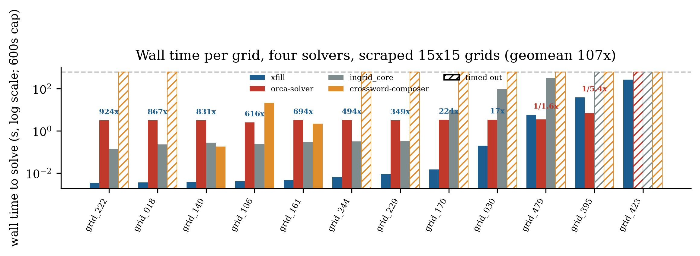

# xfill

**A parallel crossword-fill engine, and the research behind it.**

[](https://github.com/ls1881/xfill/actions/workflows/ci.yml)
[](LICENSE)
[](https://en.cppreference.com/w/cpp/20)

`xfill` fills crossword grids by modeling them as a constraint
satisfaction problem — across/down slots as variables, dictionary words
as domains, crossing letters as constraints — solved with AC-3
propagation, `dom/wdeg` branching, and a parallel restart portfolio whose
workers continuously share conflict-weight signals without ever
partitioning the problem or needing a manager. Every design decision
below is backed by a measurement, not an assumption: see
[`docs/design.md`](docs/design.md) for the full development log and
[`docs/bibliography.md`](docs/bibliography.md) for sources.

## Quickstart

Just want to build or fill in a crossword, no interest in the solver
internals? This is the whole thing, no prior experience assumed.

**1. Get the code onto your computer.** Either download it as a ZIP from
GitHub (green "Code" button → "Download ZIP") and unzip it, or, if you
have `git`:
```bash
git clone https://github.com/ls1881/xfill.git
cd xfill
```

**2. Make sure Python 3 and a C++ compiler are installed.** Open a
terminal (on a Mac: Terminal, in Applications → Utilities) and run
`python3 --version`. If that says "command not found," install
[Python 3](https://www.python.org/downloads/) first. On a Mac you'll
also need Xcode's command line tools for the compiler — run
`xcode-select --install` if `clang --version` doesn't work. On Windows,
install [WSL](https://learn.microsoft.com/windows/wsl/install), then do
everything below inside it.

**3. Start the app.** From a terminal, inside the `xfill` folder:
```bash
./gui/run.sh
```
The first run takes a minute or two — it's setting everything up
(installing a few Python packages, compiling the solver) so you don't
have to do either by hand. Every run after that starts in a couple of
seconds. Leave this terminal window open; closing it stops the app.

**4. Open it in your browser.** Go to `http://127.0.0.1:8791/`.

**5. Load a word list.** The app needs a dictionary to fill puzzles
with. Click the **Dictionaries** tab, then **Upload a dictionary**, and
pick `data/spreadthewordlist_caps.txt` from the folder you downloaded in
step 1 (a ready-to-use ~184,000-word list, already included) — or upload
your own word list instead, one `WORD;score` pair per line (see
[Dictionary format](#dictionary-format)).

**6. Build or open a puzzle.**
- **New** starts a blank grid at whatever size you choose.
- **Import** opens a `.puz`, `.ipuz`, or `.cfp` file from another program.
- Click a cell to select its across/down slot; type letters directly, or
  pick a word from the **Options** tab's suggestions.
- **Fill** auto-completes the whole grid using the word list you loaded.

**7. Save or export your work.**
- **Save** keeps a named copy inside the app, to reopen later from the
  **Load** dropdown (see "Where your puzzles are stored" below for what
  this does and doesn't mean).
- **Export** writes a real file to your computer instead: `.puz`/`.ipuz`
  for other crossword software, or a printable PDF (via the **Print**
  options) for a paper copy or a submission packet.

### Where your puzzles are stored

Everything runs entirely on your own computer — there's no server out on
the internet, no account, and nothing shared between different people's
copies of the app by default:

- **Save**/**Load** (in the app's toolbar) writes to a `gui/saves/`
  folder next to wherever you put the code, on whichever computer is
  currently running `./gui/run.sh`. It's local disk storage, not a cloud
  account — two people each running the app on their own computers have
  two completely separate `gui/saves/` folders that never see each
  other's puzzles, even with the exact same puzzle name.
- The same is true of any dictionary you upload (into `gui/dictionaries/`)
  and the browser-only autosave that resumes your in-progress grid on
  reload — all local to one computer (the autosave is local to one
  *browser*, specifically).
- If you want to hand a puzzle to someone else — a different computer,
  a different person — use **Export**, not Save. The exported file
  (`.puz`/`.ipuz`/`.cfp`/PDF) is a normal file you can email, message, or
  drop in a shared folder; they can open it with their own copy of the
  app (via **Import**) or any other crossword software that reads that
  format.
- Since two installs never share state, a second person setting this up
  fresh on their own machine gets the identical starting experience you
  did — an empty grid, no saved puzzles, and the one prompt to load a
  dictionary in step 5 above.

## Results

- **65×** faster on a hard grid purely from oversubscribing thread count (1 → 42 threads)
- **107×** geometric-mean speedup over [orca-solver](https://github.com/rainjacket/orca-solver), an independently developed partition-based competitor, on realistic 15×15 grids
- **19 of 20** benchmark grids solved or definitively ruled out, vs. 18, 17, and 9 for three comparison solvers
- **29/29** unit tests passing, CI green on every push

<p align="center">
  
</p>

<p align="center"><sub>Wall time per grid, four independent solvers, log scale — full methodology in the <a href="benchmarks/urtc2026_testbench/">reproducible benchmark suite</a>.</sub></p>

## Contents

- [Quickstart](#quickstart)
  - [Where your puzzles are stored](#where-your-puzzles-are-stored)
- [Status](#status)
- [How the algorithm works](#how-the-algorithm-works)
  - [Known limits](#known-limits)
- [Dictionary format](#dictionary-format)
- [Grid format](#grid-format)
- [Building](#building)
- [Running](#running)
- [Python CLI](#python-cli)
- [GUI](#gui)
- [Benchmarking](#benchmarking)
- [License](#license)

## Status

✅ Slot detection, crossing computation, no-duplicate-words enforcement,
queue-based AC-3 propagation, `dom/wdeg` branching, randomized restarts,
and a parallel-restart portfolio search (`Solver::SolveParallel`, `xfill_cli`'s
default) are all implemented and tested (29/29 tests passing). Small and
medium grids (tested up to 15x15 with real block patterns, against a real
~184k-entry dictionary at `min_score=40`) solve in well under a second;
some genuinely dense grids remain intractable, which is a documented,
expected limit (see "Known limits" below and
[`docs/design.md`](docs/design.md)'s "Known hard cases" section for more),
not a bug.

## How the algorithm works

This section is kept up to date as `Solver` changes — for the full
reasoning and citations behind each piece, see
[`include/xfill/solver.hpp`](include/xfill/solver.hpp)'s class comment
(most detailed and most current) and
[`docs/bibliography.md`](docs/bibliography.md) (sources).

1. **Model.** Every across/down run of open cells is a *slot* (a
   variable); its *domain* is every same-length dictionary word; a
   *crossing* between two slots is a constraint that they agree on their
   shared letter. Domains are `WordBitset`s — one bit per word of that
   length — so intersecting/narrowing a domain is a handful of `uint64_t`
   operations rather than a loop over strings.
2. **Propagation.** After every assignment, `Propagate` runs queue-based
   AC-3: only slots whose domain actually shrank get re-examined (not a
   fixed rescan of every crossing), and it skips a narrowing step
   entirely when either every letter is still viable at that position, or
   the neighbor's domain is already a subset of the incoming filter.
   (Source: `rainjacket/orca-solver`.) Checking "which letters are viable
   at this crossing" takes one of two paths depending on how narrow the
   slot's domain already is: a domain below `kDirectLookupThreshold`
   candidates reads their actual letters directly (cheap once
   `WordBitset::SetBits()` skips zero chunks via `ctz` instead of testing
   every index one at a time); a wider domain tests all 26 `LetterMask`s
   against it instead, since materializing every surviving candidate
   isn't worth it when there are thousands of them. This split -- and the
   `SetBits()` fix, reusing one scratch bitset per length instead of
   heap-allocating a fresh one per crossing, indexing all per-length state
   (`LetterMask`, that scratch bitset) directly by length instead of
   through a hash map, and reusing the propagation queue's membership
   buffer across calls instead of reallocating it per node -- came
   directly out of `sample`-profiling real (scraped, not synthetic) 15x15s
   that were timing out.
3. **Branching.** `SelectBranchSlot` picks which slot to guess next using
   `dom/wdeg`: (masked domain size) ÷ (summed weight of this slot's
   crossings to still-unassigned neighbors), lowest first. Crossing
   weights start at 1, get bumped by 1 whenever propagation through that
   crossing wipes out a domain, and decay 1% back toward 1 on every other
   wipeout — so the heuristic tracks *currently* troublesome crossings
   instead of a fixed notion of constrainedness. (`CrossingWeights`
   computes this lazily — one crossing updated per wipeout rather than
   decaying all of them every time — a VSIDS-style trick borrowed from
   MiniSat; see `docs/bibliography.md`'s Eén & Sörensson entry.) Word
   choice within a
   slot always tries higher dictionary-score words first (`ScoreOrder`),
   so a fill reads like a real crossword instead of the first
   alphabetically-valid guess. (Source: `rf-/ingrid_core`, crediting
   Balafoutis's "Adaptive Strategies for Solving CSPs".) Below a
   candidate-count threshold, the live candidates are extracted directly
   and sorted by a precomputed score rank instead of walking every word of
   that length checking membership — the same "direct extraction below a
   threshold" split step 2 uses for letter viability, applied here to word
   selection; see `docs/design.md` for the measured effect and a
   correctness bug this surfaced and fixed along the way.
4. **Backtracking.** Trail-based: assigning a slot snapshots only the
   domains that assignment actually touches (once per decision level),
   so undoing a decision restores exactly what changed rather than
   copying every slot's domain at every search node. (Source:
   `rainjacket/orca-solver`.)
5. **Restarts.** The whole search in steps 2-4 runs inside a retry loop.
   The first attempt is fully deterministic (greedy `dom/wdeg`). If an
   attempt racks up more dead ends than its budget (starts at 500, grows
   ×1.1 per retry), it aborts and restarts from the root with a new RNG
   seed — restarts after the first pick their branch slot via a
   weighted-random choice among the best few `dom/wdeg`-ranked slots
   (weights `{4, 2, 1}`) instead of always the single best, so different
   attempts actually explore different branch orders. Crossing weights
   learned by `dom/wdeg` carry over across restarts; only the search tree
   itself starts over. Because the budget only ever grows, this stays a
   *complete* search — an unsatisfiable grid is still eventually proven
   so. (Sources: `rf-/ingrid_core`'s restart loop for the mechanism;
   Gomes, Selman & Kautz, "Boosting Combinatorial Search Through
   Randomization," for *why* it helps — backtracking search runtimes are
   often heavy-tailed, so an attempt that's had a demonstrably unlucky
   run is better abandoned than waited out.)
6. **Duplicate words.** A slot's effective domain is always masked
   against a global "words of this length already used elsewhere" bitset,
   rather than writing exclusions into every sibling domain on each
   assignment — so no word is ever placed twice in one fill.
7. **Component-restricted branching.** `Solver` computes the connected
   components of the slot-crossing graph once at construction time (one
   BFS pass), and branching only ever considers the lowest-indexed
   component that still has an unassigned slot — fully settling one
   before starting the next, since components sharing no crossing can
   never help or hurt each other's search. This is the crossword analogue
   of the "critical junction" structure road-routing algorithms exploit
   (see `docs/bibliography.md`'s Dechter entry): it's a free no-op for
   any single-component grid — which is every curated grid here *and*
   every one of the 500 real scraped grids, since well-built crosswords
   are essentially always fully interlocked — but a real ~2.6x win on a
   grid that does have independent regions (see
   `benchmarks/grids/synthetic/disconnected_15x15.txt`, one of two
   purpose-built edge-case grids alongside `rectangular_9x5.txt`, which
   tests a non-square grid).
8. **Parallel restarts.** `Solver::SolveParallel` runs several independent
   restart sequences at once (`hardware_concurrency()` threads by
   default, `xfill_cli`'s default) instead of steps 2-6's single retry
   loop — a direct, if belated, application of the Gomes/Selman/Kautz
   heavy-tailed-runtime result above: if a *different* random run of the
   same search often finishes fast, running several simultaneously
   should find one that does sooner in wall-clock time. Each worker gets
   its own private `Solver` (own domains, trail, crossing weights,
   nogoods, RNG); synchronization is one `std::atomic<bool>` cancellation
   flag, checked once per node. Worker 0 reproduces today's exact
   single-threaded sequence; every other worker's own first attempt is
   already randomized so it doesn't just redo worker 0's deterministic
   pass for free. Base portfolio effect, measured before either addition
   below: a real, large net win on the real benchmark set but not a
   uniform one (three 30-grid samples: -43.6% total time, two
   previously-timing-out grids newly solved, zero lost; a handful of
   grids already close to worker 0's best case get *slower* from added
   thread contention with no compensating benefit) — see `docs/design.md`
   for the full numbers and `docs/bibliography.md`'s Gomes, Selman &
   Kautz entry.

   Two things layered on top since. One worker (whenever there's more
   than one) is dedicated to a single uninterrupted exhaustive search
   (`unlimited_budget`), guaranteeing the whole call eventually reaches a
   genuine conclusion even on grids where restart-based search alone
   never does (see `docs/design.md`'s "Tried and kept: `unlimited_budget`
   in `SolveParallel`"). And every *restart* worker (not the dedicated
   one) also reads and bumps one shared array of plain atomic counters
   (`SharedCrossingWeights`) on top of its own private weights — a
   crossing several workers have all struggled with gets deprioritized
   everywhere, not just wherever it was first hit (see `docs/design.md`'s
   "Tried and kept: crossing weights shared across `SolveParallel`
   workers" for the measured effect, which is real but regime-dependent,
   not uniform). Completeness works differently from the base version
   above as a result: the first worker to reach a genuine (not itself
   cancelled) conclusion — solution found, or an exhaustive proof there
   isn't one — cancels every other worker immediately; it does not wait
   for all of them to finish.

   Pass an explicit `num_threads` of 1 for the old single-threaded
   behavior.

### Known limits

`benchmarks/grids/curated/sample_13x13.txt` still hasn't finished after
15+ minutes, even at `min_score=40` -- confirmed still true even with
`SolveParallel`'s 14-way portfolio search (also stopped after 20+
minutes with no solution). That's an expected result, not a bug: per
Anbulagan & Botea's phase-transition study of crossword CSPs, some
"hard region" instances stay expensive for *any* search order, because
the underlying instance itself is hard, not just this solver's choices
leading up to it -- restarts (and, by the same logic, more of them at
once) fix a search that got *unlucky*, but can't turn a genuinely hard
instance easy. `sample_15x15.txt` (the original,
fully-open-interior 15x15, as opposed to `sample_15x15_interlock.txt`
which solves quickly) is not in that category: single-threaded, it solves
in about 15.1s at `min_score=40` -- much faster than the ~158s this took
earlier in the project's history, thanks to the propagation and restart
optimizations in `docs/design.md`'s "Implementation summary" (with
default parallel restarts it drops to roughly 1-2s, varying run to run)
-- it just needs a less-restricted dictionary, not a fundamentally
harder search.
`sample_21x21.txt` is different again: it's proven unsatisfiable in
microseconds, because it has a fully-open 21-cell row and the dictionary
has no words that long even at `min_score=0` (max length 15) -- not a
search problem at all.

## Dictionary format

One entry per line, semicolon-delimited: `WORD;SCORE`. Score is used two
ways: entries below `min_score` (the solver's third CLI argument) are
dropped from the dictionary entirely at load time, and among the words
that remain, the solver tries higher-scored ones first within each slot
(`Dictionary::ScoreOrder`) so a fill reads like a real crossword rather
than the first alphabetically-valid guess. Words are uppercased on load,
so mixed-case input is fine.

`min_score=40` is the recommended default for `data/spreadthewordlist_caps.txt`
specifically (and is what `benchmarks/bench_subset.py` defaults to) --
see `docs/design.md`'s "Dictionary tuning" section for why lower
thresholds stop helping solvability and start hurting fill quality in
this particular wordlist.

```
CAT;50
DOG;40
```

Drop your wordlist in `data/` (e.g. `data/spreadthewordlist_caps.txt`)
and pass its path as the second CLI argument.

## Grid format

One row per line, `.` for an open cell and `#` for a block:

```
...#...
...#...
.......
##...##
.......
...#...
...#...
```

Generate a random symmetric one with `benchmarks/generate_grid.py`.

## Building

Requires CMake 3.20+ and a C++20 compiler.

```bash
cmake -S . -B build -DCMAKE_BUILD_TYPE=Release
cmake --build build --parallel
ctest --test-dir build --output-on-failure
```

## Running

```bash
./build/xfill_cli <grid_spec_file> <dictionary_file> [min_score] [num_threads]
```

`num_threads` defaults to 0, meaning `std::thread::hardware_concurrency()`
(see "Parallel restarts" above). Pass `1` for the old single-threaded
behavior — useful for reproducible timing, or comparing against a build
predating `SolveParallel`.

## Python CLI

`xfill_cli` above only understands the plain-text grid-spec format, and
takes a dictionary/min-score pair as raw positional arguments or flags —
fine for benchmarking and scripting against the engine directly, but not
what you want if your puzzle is a real `.puz`/`.ipuz` file and you'd
rather not hand-convert it first. `gui/backend/cli.py` is a thin
higher-level wrapper around the exact same C++ solver (it shells out to
`xfill_cli` under the hood, via `solver_bridge.py`) that reads and writes
real crossword files directly, and lets dictionary/score settings live in
a JSON config file instead of being retyped on every invocation.

It has no dependencies beyond the standard library and the built
`xfill_cli` binary — no `pip install`, no virtualenv, unlike the GUI's own
backend (below) which needs FastAPI/uvicorn. Requires Python 3.10+.

```bash
# Same dictionary/min-score for both directions, written to
# mypuzzle_filled.puz next to the input (the default output path when -o
# is omitted).
python3 gui/backend/cli.py mypuzzle.puz --dict data/spreadthewordlist_caps.txt --min-score 40

# Different dictionary/threshold per direction, explicit output path.
python3 gui/backend/cli.py grid.txt \
  --across-dict across.txt --across-min 30 \
  --down-dict down.txt --down-min 50 \
  -o filled.txt

# Keep your usual settings in a config file; override just one flag
# for this run.
python3 gui/backend/cli.py mypuzzle.ipuz --config myconfig.json --maximize
```

Accepted input formats (auto-detected by extension): `.puz`, `.ipuz`,
`.cfp` (best-effort — see `gui/backend/cfp_format.py`'s own docstring for
why), or xfill's own plain-text grid-spec format under any other
extension (`.txt` is the natural choice) — the same `.`/`#`/letter format
`xfill_cli` takes directly. Output format is inferred from `-o`'s
extension, or forced explicitly with `--format {puz,ipuz,cfp,txt}`.

A rebus square already placed in the input (a cell holding more than one
character, e.g. `"STAR"`) is preserved exactly and its slot is solved at
its real, full length — a 5-cell slot with a 2-character rebus square
searches 6-letter words, not 5-letter ones. The solver never invents a
new rebus square on its own; it only ever completes the rest of a slot
that already has one. `--maximize` runs the same branch-and-bound
score-maximizing search as `xfill_cli`'s own `--maximize` flag, and is
interruptible with Ctrl+C (keeps the best fill found so far rather than
losing all progress).

Run `python3 gui/backend/cli.py --help` for the full flag reference, or
`--show-config-example` to print a config file with every recognized key:

```json
{
  "across_dict": "/path/to/across_words.txt",
  "across_min_score": 40,
  "down_dict": "/path/to/down_words.txt",
  "down_min_score": 40,
  "across_min_overrides": { "3": 10, "15": 60 },
  "down_min_overrides": {},
  "threads": 0,
  "maximize": false
}
```

A flag on the command line always overrides the same setting from
`--config` — the config file is meant to hold your everyday defaults
(dictionary paths, a usual minimum score), with flags for one-off
tweaks. `--dict`/`--min-score` are a shorthand for "both directions the
same"; `--across-*`/`--down-*` (as flags or config keys) still win over
that shorthand for their own direction specifically.

## GUI

A browser-based constructor tool — grid editing, dictionary-driven Fill
(this same solver, with live progress), a rebus editor, .puz/.ipuz/.cfp
import/export, NYT-submission and one-page print layouts, and more — sits
in `gui/`. Unlike the CLI above, it does need its own dependencies
(FastAPI/uvicorn); `gui/run.sh` handles all of it — first run creates a
venv and installs `gui/backend/requirements.txt`, builds `xfill_cli` if
it isn't already, then starts the server:

```bash
./gui/run.sh
```

Then open `http://127.0.0.1:8791/` in a browser (`PORT=...` env var to
use a different port). It serves both the API and the static frontend
from that one process — nothing else to run.

## Benchmarking

```bash
./benchmarks/run_benchmarks.sh ./build/xfill_cli data/spreadthewordlist_caps.txt
```

Grids in `benchmarks/grids/curated/` were generated with:

```bash
python3 benchmarks/generate_grid.py --size 15 --block-pairs 18 > benchmarks/grids/curated/sample_15x15.txt
```

`benchmarks/grids/synthetic/` holds a couple of hand-built grids that
target one specific solver behavior each rather than general sizing
(disconnected components, a non-square shape) — see step 7 above.

`benchmarks/grids/scraped_15x15/` holds 500 real 15x15 grid layouts
(block patterns only, via `benchmarks/scrape_crosswordgrids.py`) —
a much harder, more realistic benchmark set than the small curated one
above. `benchmarks/bench_subset.py` runs a reproducible random sample of
them against `xfill_cli`, with a per-grid timeout, and can diff two runs
against each other:

```bash
python3 benchmarks/bench_subset.py --n 20 --seed 42 --save before.csv
# ...make a change...
python3 benchmarks/bench_subset.py --n 20 --seed 42 --compare before.csv
```

## License

MIT — see [LICENSE](LICENSE).
